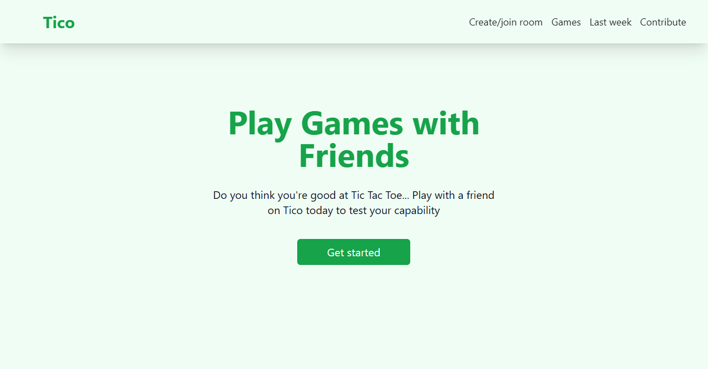
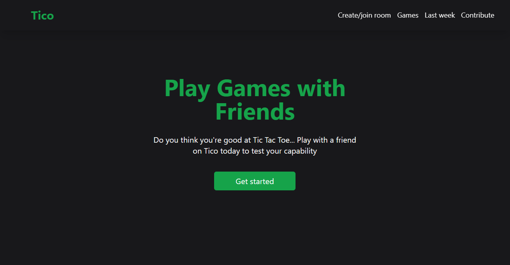
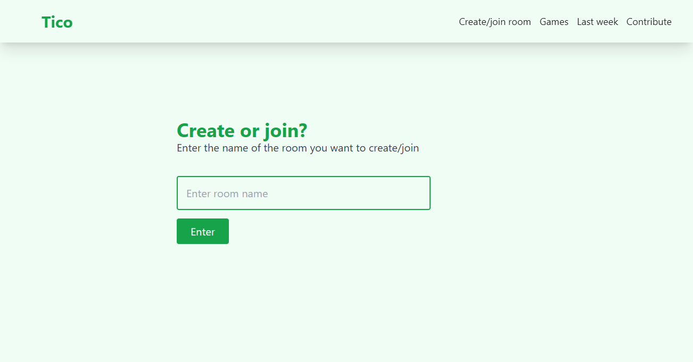
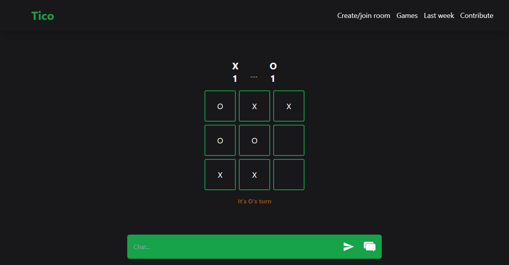
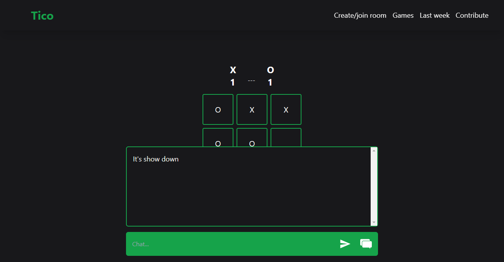

# Tico
_Play tictactoe with friends_

# 📷 Screenshots




- ### Create game rooms:


- ### Game play:


- ### Chat:


## To run locally:
**1.** Clone the repository 
```sh
git clone <repository_url>
```

**2.** Install dependencies 
```sh
npm install
```

**3.** Run the development server 
```sh
npm run dev
```
### Enjoy Tico
[Visit the site](https://silent-lofty-geese.glitch.me)
